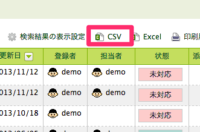
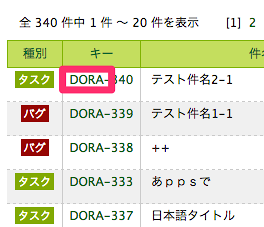

# Backlog-Issue-Importer

[Backlog](http://www.backlog.jp/) の「課題」を CSV ファイルから擬似的に一括インポートします。

## 機能概要

ログインに利用したアカウントを作成者として課題を操作します。
CSV ファイルに定義された状態となるまで、以下の順に登録と更新が行われます。

- 課題を作成し「件名」を登録、以下の項目があれば更新する。
  - 「種別」「カテゴリー名」「バージョン」「詳細」「優先度」「マイルストーン」「期限日」
- 「完了理由ID」があれば更新する。
- 「コメント」があれば更新する。
- 「状態ID」があれば更新する。

インポート先の Space に存在しない「種別」「カテゴリー名」「バージョン(マイルストーン)」があれば、事前に作成します。


## 動作環境

ShiftJIS 及び、UTF-8 ファイルに対応。
以下の環境で動作を確認しました。

- Mac OS X Marvericks / Ruby 2.1.1p76
- http://demo.backlog.jp (ID: demo / PW: demo)
- [Backlog [バックログ] - フリープラン](http://www.backlog.jp/)


## インストール

```
% git clone git@github.com:DriftwoodJP/Backlog-Issue-Importer.git
```


## つかいかた

Backlog から CSV ファイルをダウンロードします。
必要があれば編集します。



CSV ファイルを指定します。

```
% ruby import_issue.rb file.csv
Space: demo
User: demo
Password:
Project Key: DORA
```

設定ファイルを利用する場合は、以下のように指定します。

```
% ruby import_issue.rb -c config.rb file.csv
```


### ログイン情報の確認方法

Backlog 上で確認できます。

* Space ... URLのサーバ名
* User ... アカウント名
* Password ... パスワード
* Project Key ... 課題一覧などから確認できます（下図参照）。




## 更新対象項目

バックログからダウンロードした CSV ファイルのフォーマットは以下のとおりです。
記載の内、'projectId', 'key', 'assignerId' を除いた項目を登録します。

|    | API Method | createIssue   | updateIssue    | addComment | switchStatus |
|----|------------|---------------|----------------|------------|--------------|
| 1  | ID         |               |                |            |              |
| 2  | プロジェクトID   | projectId     |                |            |              |
| 3  | プロジェクト名    |               |                |            |              |
| 4  | キーID       |               |                |            |              |
| 5  | キー         |               | key            | key        | key          |
| 6  | 種別ID       |               |                |            |              |
| 7  | 種別         | (issueType)   |                |            |              |
| 8  | カテゴリーID    |               |                |            |              |
| 9  | カテゴリー名     | (component)   |                |            |              |
| 10 | バージョンID    |               |                |            |              |
| 11 | バージョン      | (version)     |                |            |              |
| 12 | 件名         | summary       |                |            |              |
| 13 | 詳細         | (description) |                |            |              |
| 14 | 状態ID       |               |                |            | statusId     |
| 15 | 状態         |               |                |            |              |
| 16 | 優先度ID      |               |                |            |              |
| 17 | 優先度        | (priority)    |                |            |              |
| 18 | マイルストーンID  |               |                |            |              |
| 19 | マイルストーン    | (milestone)   |                |            |              |
| 20 | 完了理由ID     |               | (resolutionId) |            |              |
| 21 | 完了理由       |               |                |            |              |
| 22 | 担当者ID      | <s>(assignerId)</s>  |                |            |              |
| 23 | 担当者        |               |                |            |              |
| 24 | 作成者ID      |               |                |            |              |
| 25 | 作成者        |               |                |            |              |
| 26 | 作成日        |               |                |            |              |
| 27 | 期限日        | (due_date)    |                |            |              |
| 28 | 更新者ID      |               |                |            |              |
| 29 | 更新者        |               |                |            |              |
| 30 | 更新日        |               |                |            |              |
| 31 | 添付         |               |                |            |              |
| 32 | 共有         |               |                |            |              |
| 33 | コメント1      |               | (comment)      |            |              |
| 34 | コメント2      |               |                | content ※    |              |

※ 以降、増えたコメント分を追加します。


## 参考

既知の問題があります。

> * [Backlog の課題を擬似的にインポートする | deadwood](http://www.d-wood.com/blog/2014/06/04_6309.html)
